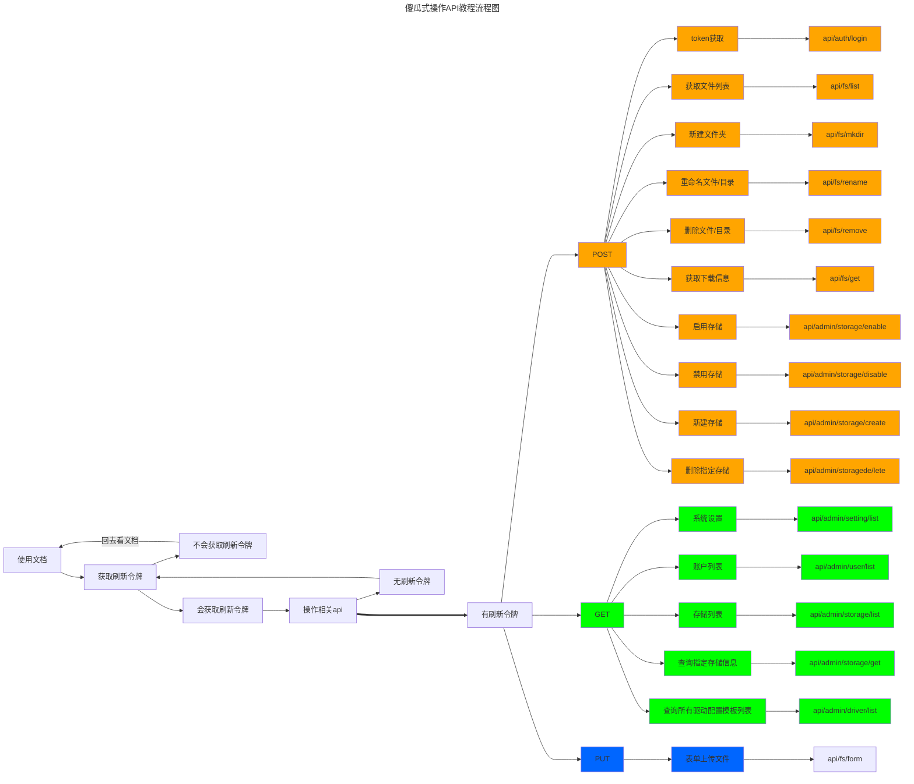

---
# 这是文章的标题
title: 傻瓜式操作AList API教程
# 这是页面的图标
icon: fa-solid fa-rocket-launch
# 这是侧边栏的顺序
order: 15
# 设置作者
author: 安稳
# 设置写作时间
date: 2023-01-01
# 一个页面可以有多个分类
category:
  - 使用指南
# 一个页面可以有多个标签
tag:
  - AList
  - Windows
  - Linux
  - API
  - 教程
  - 安装
# 此页面会在文章列表置顶
sticky: true
# 此页面会出现在文章收藏中
star: true
# 你可以自定义页脚
# footer: true

# 你可以自定义版权信息
# copyright: 无版权
headerDepth: 6
---

<!-- 你可以通过设置页面的 Frontmatter，在页面禁用功能与布局。 -->

<!-- more -->

## 前言

大概的流程就是下面流程图这样的一个流程，大佬不用看都懂，这个是给小白看的，拉到下面我们说一下怎么个流程吧

> - POST token获取 /api/auth/login
> - POST 获取文件列表 /api/fs/list
> - POST 新建文件夹 /api/fs/mkdir
> - POST 重命名文件/目录 /api/fs/rename
> - POST 删除文件/目录 /api/fs/remove
> - PUT 表单上传文件 /api/fs/form
> - POST 获取下载信息 /api/fs/get
> - GET 系统设置 /api/admin/setting/list
> - GET 账户列表 /api/admin/user/list
> - GET 存储列表 /api/admin/storage/list
> - POST 启用存储 /api/admin/storage/enable
> - POST 禁用存储 /api/admin/storage/disable
> - POST 新建存储 /api/admin/storage/create
> - GET 查询指定存储信息 /api/admin/storage/get
> - GET 查询所有驱动配置模板列表 /api/admin/driver/list
> - POST 删除指定存储 /api/admin/storage/delete

上述API来自：**https://github.com/alist-org/alist/discussions/2501**  | [@Kuingsmile](https://github.com/Kuingsmile)大佬整理发布

在教程之前先说一下怎么都是 /api/xxx/xxx ？这怎么使用？

- 前面是通用链接，这个链接就是我们自己的AList网站链接，可以是域名可以是IP，可以是http也可以是HTTPS，也能带端口号
- 例如我本地的就是：http:\//192.168.31.103:5244，到时候我们直接请求`http://192.168.31.103:5244/api/auth/login` 然后填写相关参数就能请求到

我这里使用的请求软件是[postman](https://www.postman.com/)，因为老早之前apifox还没出的时候就在用postman了...

- 或者使用[Apifox](https://apifox.com/)

 

::: center
敬请期待
:::

